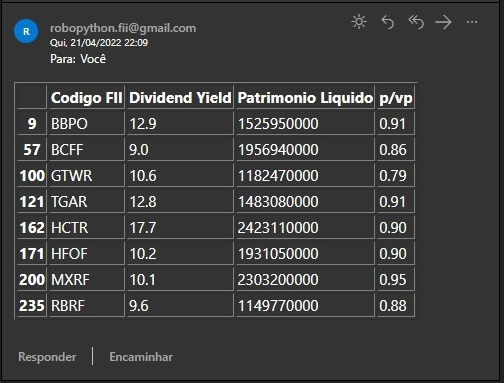

# Robô para filtragem de fundos imobiliarios

## Descrição:

A ideia central do projeto é poupar tempo para a pessoa interessada em comprar um fundo imobiliario, com o envio de um email ao final do processo, trazendo uma tabela com os Fiis que passaram por todos os filtros setados pelo robô.

## Requisitos

- Baixar o "chromedriver.exe" para a pasta do robô.
- Instalar Selenium - "https://www.selenium.dev/documentation/webdriver/getting_started/"

## Status

O projeto encontra-se em andamento.

## Exemplo de Output

